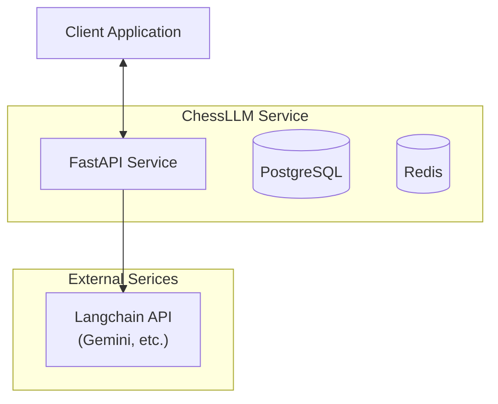
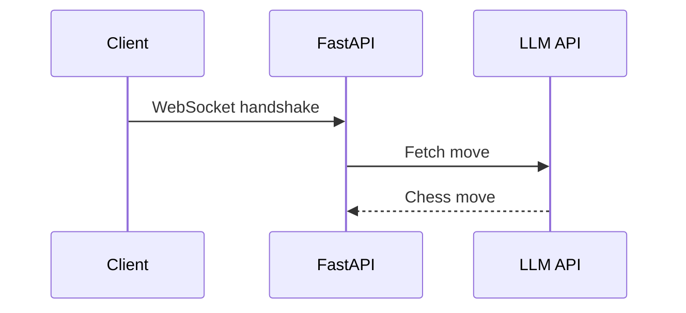

# Architecture
*kafka and db planned*

```mermaid
graph TB
    subgraph "ChessLLM Service"
        API["FastAPI Service"]
        db[("PostgreSQL")]
        cache[("Redis")]
    end

    subgraph "External Serices"
        LLM["Langchain API </br>(Gemini, etc.)"]
    end

    Client["Client Application"]

    Client <--> API
    API --> LLM

```

# Flow diagrams
webhook

```mermaid
sequenceDiagram
    participant C as Client
    participant A as FastAPI
    participant L as LLM API

    C ->> A: WebSocket handshake
    A ->> L: Fetch move
    L -->> A: Chess move
```
