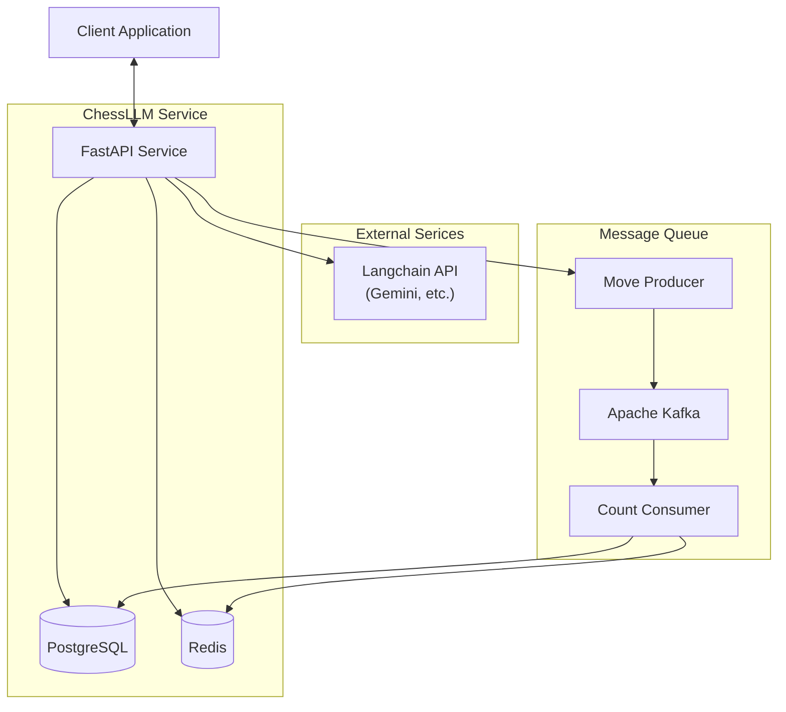
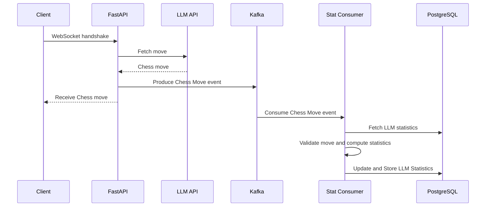
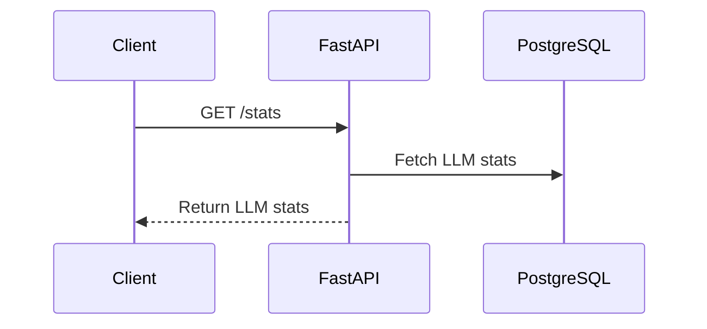

# Architecture
*planned*

```mermaid
graph TB
    subgraph "ChessLLM Service"
        API["FastAPI Service"]
        db[("PostgreSQL")]
        cache[("Redis")]
    end

    subgraph "External Serices"
        LLM["Langchain API </br>(Gemini, etc.)"]
    end

    subgraph "Message Queue"
        Producer["Move Producer"]
        Kafka["Apache Kafka"]
        Consumer["Count Consumer"]
    end

    Client["Client Application"]

    Client <--> API
    API --> LLM
    API --> Producer
    API --> db
    API --> cache
    Producer --> Kafka
    Kafka --> Consumer
    Consumer --> db
    Consumer --> cache

```

# Flow diagrams
webhook

```mermaid
sequenceDiagram
    participant C as Client
    participant A as FastAPI
    participant L as LLM API
    participant K as Kafka
    participant ST as Stat Consumer
    participant DB as PostgreSQL

    C ->> A: WebSocket handshake
    A ->> L: Fetch move
    L -->> A: Chess move
    A ->> K: Produce Chess Move event
    A -->> C: Receive Chess move
    K ->> ST: Consume Chess Move event
    ST ->> DB: Fetch LLM statistics
    ST ->> ST: Validate move and compute statistics
    ST ->> DB: Update and Store LLM Statistics
```

Get Statistics

```mermaid
sequenceDiagram
    participant C as Client
    participant A as FastAPI
    participant DB as PostgreSQL

    C ->> A: GET /stats
    A ->> DB: Fetch LLM stats
    A -->> C: Return LLM stats
```